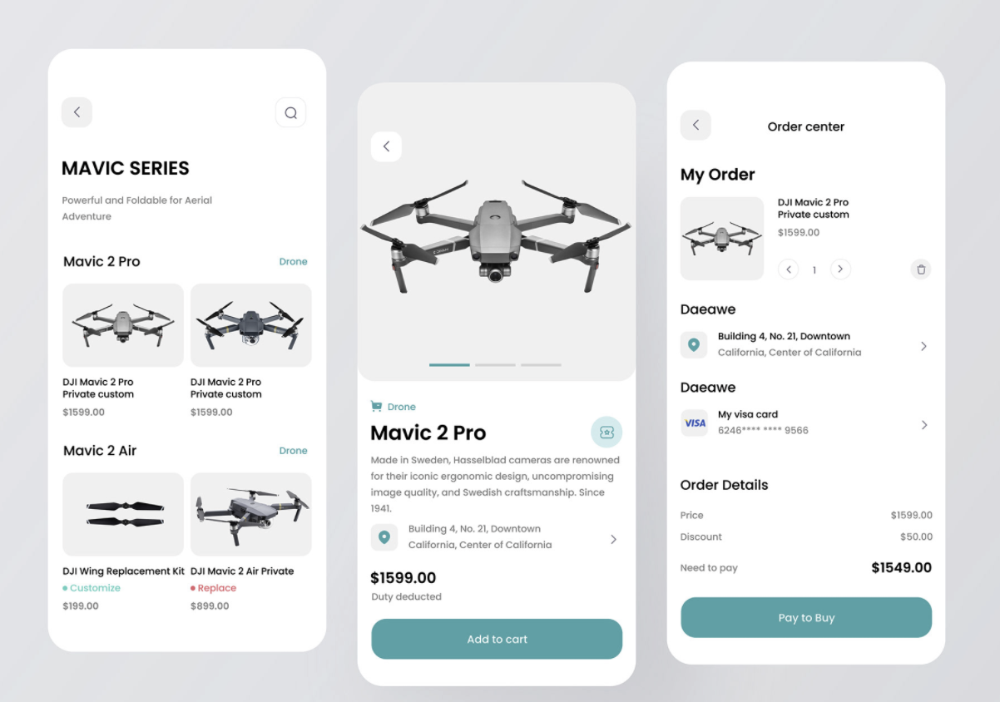

# IONIC UI SERIES

## Mobile UI for drone selling application

# Made with :
 * Ionic
 * Angular Typescript
 * HTML5
 * SCSS

# How to run

 * clone the repo
 ````bash
 
 git clone https://github.com/stevehoober254/saleDrone 
 
 ````
 * Run npm install
 
 ````bash
 npm install
 
 ````
 * Run npm serve  
 
 ````bash
 
 ionic serve
 
 ````

# Contains three screens
# UI Credits to Alan Love.



